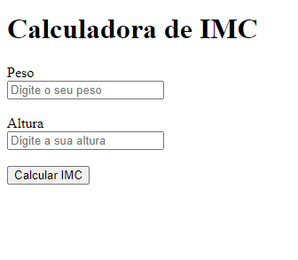

# Calculadora de IMC

 Demonstração da tela

## Sobre

Este é um projeto simples de uma Calculadora de Índice de Massa Corporal (IMC) desenvolvido utilizando apenas HTML e JavaScript. A calculadora permite que os usuários insiram seu peso e altura para calcular seu IMC e receber uma classificação.

## Funcionalidades

- Cálculo do IMC com base na fórmula: IMC = peso / (altura * altura)
- Classificação do IMC:
  - Abaixo do peso: abaixo de 18.5
  - Peso normal: IMC entre 18.5 e 24.9
  - Sobrepeso: IMC entre 25.0 e 29.9
  - Obesidade: IMC entre 30.0 e 39.9
  - Obesidade grave: acima de 40.0

## Tecnologias Utilizadas

- HTML
- JavaScript
